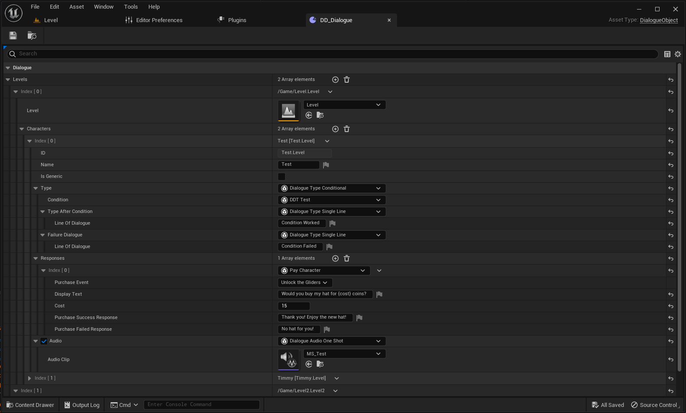
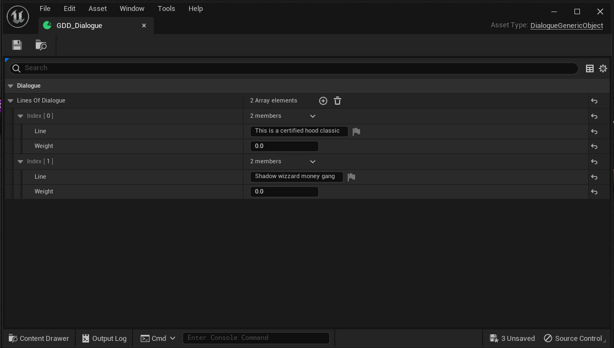
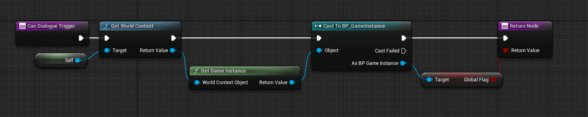
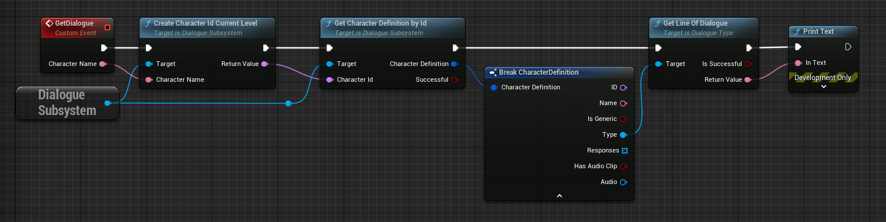

# Dialogue System for Unreal Engine
###### This project was designed around a system that was already half built and therefore does not include any UX examples of how to access the data. Therefore I don't recommend actually trying to use this system.

This is a plugin that was created to help manage dialogue within an Unreal Engine project.

It adds a new object type that maps a list of levels to a definition of a character.

A new subsystem is created to access data from the dialogue definitions.

## Dialogue Objects
### Dialogue Definition

*A screenshot showing an example dialogue definition*

In the above example, I am creating a character for the level called `Level` with a name of Test.
Upon entering the characters name an ID is generated from a combination of the level name and character name (in this case `Test.Level`).
This character is marked as not generic, meaning their dialogue is not taken from the generic pool of dialogue (see [Generic Dialogue Definition](#generic-dialogue-definition)).
A dialogue type is assigned from a list of [types](#dialogue-types--modifiers) which is then instanced, giving you a drop down of variables.
In this example, a 'Conditional Dialogue' type is used, with `Single Line` types used for both the success and failure of the condition.
After the type of dialogue has been reached, if any responses are defined they can be listed and selected (no way to do this included with this plugin).
Responses are options the user is given after a set of dialogue.
While the system doesn't allow for full trees of dialogue, it allowed for enough branches for the needs of our project.
The example has one response - a `Pay Character` response.
This costs 15 coins and allows the user to buy a hat from an NPC.

### Generic Dialogue Definition

*A screenshot showing an example generic dialogue definition*

Generic Dialogue Definitions are objects for storing a list of dialogue that could be used by any non-important NPCs.
When `Get Line of Dialogue` is called on a generic NPC, a random line is chosen from this definition.
At the moment, the weight value connected to each line of dialogue is not used, but in theory could be used to make some lines of dialogue more common than others.

## Dialogue Types & Modifiers
### Dialogue Types
Single Line - Returns a single line of dialogue.

Random - Returns a random line of dialogue from a list.

Continuous - Allows a list of dialogue to be played in sequence. 
Each call of `Get Line of Dialogue` will advance the dialogue.

Conditional - Allows two types of dialogue to be switched between based on a condition.

Multi Conditional (Unused) - Allows for multiple conditions to be checked at once (I think. Honestly I barely implemented this)

No Dialogue - Skips the dialogue phase and goes straight to the responses.

### Response Types
Interact - A generic response that allows the 

Pay - Allows the user to purchase an item from an NPC. 
Allows the user to define a cost, successful and unsuccessful purchase lines of dialogue, and an event to be broadcast upon successful purchase.

Condition - Allows a response to be shown based on a condition.
Takes a condition and a response type as parameters.

## Conditions
Conditions are a blueprint class with an overridable function. 
This system allows logic to be used to get a boolean from anywhere in the game.

*An example of a condition. This condition returns a global boolean from a game instance*

## Audio
Audio can be attached to the dialogue and has two types:

### One-Shot
One-Shot audio will play once at the start of a line of dialogue.
If the dialogue is skipped then the audio is cancelled.

### Loop
Looped dialogue will play for each word/character of the line of dialogue.
If the dialogue is skipped then the audio is cancelled.

## Small Example

*An example blueprint of getting a line of dialogue*

The above code is a small example of getting a line of dialogue from a character.
Each time `Get Line of Dialogue` is called, an internal counter on the type object in incremented, allowing for the next `Get Line of Dialogue` call to fetch a different line of dialogue.

## Installation
To install the plugin, a C++ project is needed in order to initially compile the plugin.

Once the plugin has been compiled though it can be moved to a blueprint project for use.

1. Clone this repo to the plugins folder of a C++ project.
2. Open up your IDE of choice.
3. Compile the project.
4. Voila!